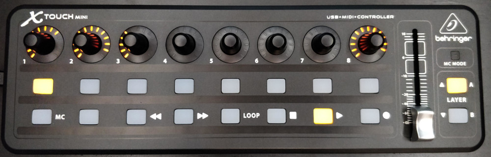

# Control PulseAudio with a MIDI controller

This project lets you use the Behringer X-Touch Mini to control your audio.
It integrates with PulseAudio and maps every audio channel to an encoder on the Behringer X-Touch Mini.

## Features

* The volume of every audio channel (input or output) in PulseAudio is controllable with an encoder on the Behringer X-Touch Mini.
* All audio channels can be muted using the buttons below the encoders.
* The LED ring around the encoders will show the volume level.
* Audio in your browser or in a program like Spotify can be played, paused, stopped.
* When media is playing or paused, the play button is lit or blinking.
* The first encoder is always the main volume, the last is always the active microphone.



## Dependencies

* Ubuntu or other Linux distro that uses PulseAudio
* Package `playerctl` to be able to control the media (`sudo apt install playerctl`)
* Package `libasound2-dev` and `python` for the MIDI library (`sudo apt install libasound2-dev python`)
* Node 16+
* NPM 7+

## How to use

Checkout this repository, connect your Behringer X-Touch Mini (in standard mode), and run the following commands;

```
npm install
npm run start
```

The output will show how the audio channels are mapped to the encoders. This updates every second;

```
...
Controller 1: Built-in Audio Analog Stereo
Controller 2: Google Chrome
Controller 3: spotify
Controller 8: Blue Snowball Mono
```